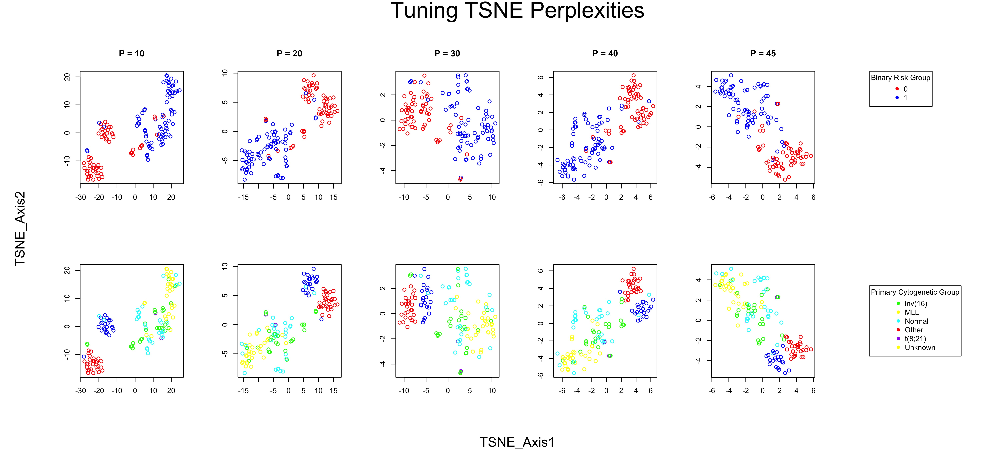
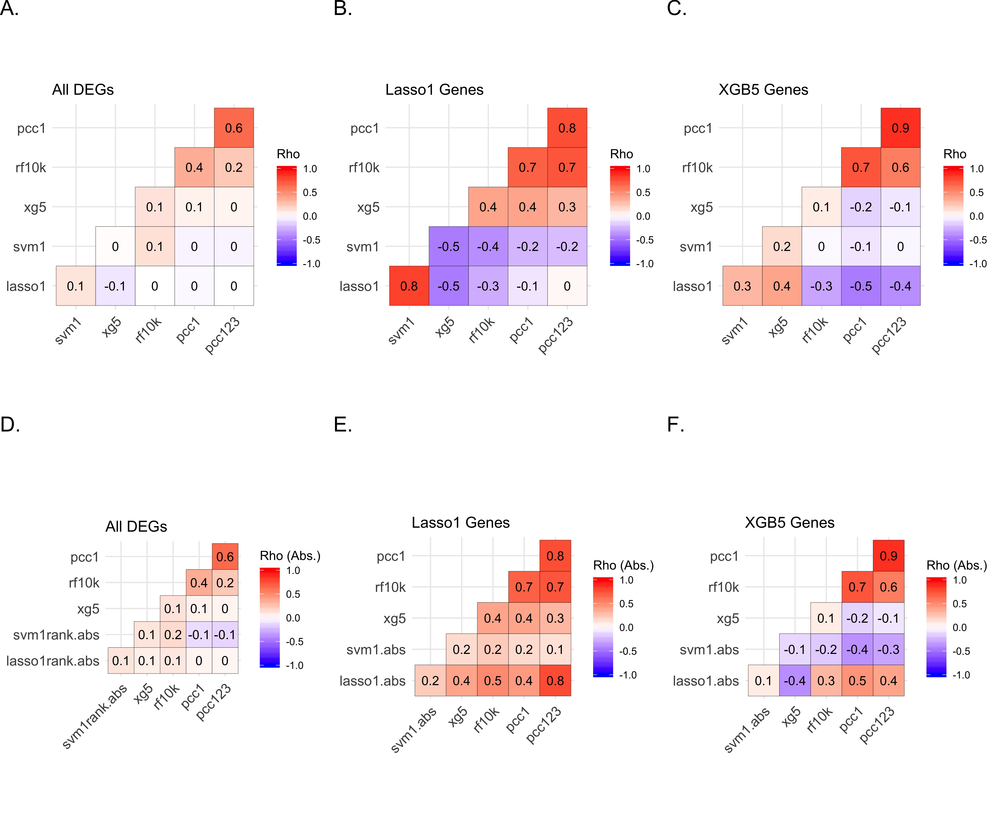
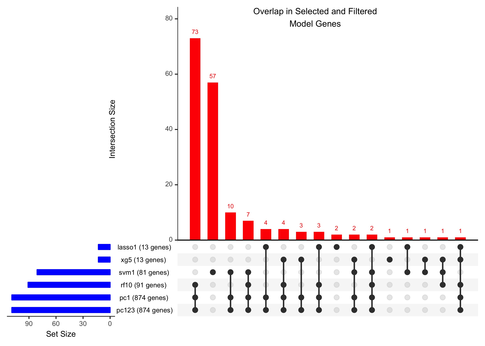

This notebook contains supplemental findings for the manuscript "". 

```{r opts, echo=F, eval=T}
knitr::opts_chunk$set(echo=F, eval=F)
```

```{r, dependencies, echo=F, eval=F}
library(SummarizedExperiment)
library(gridExtra)
library(ggplot2)
library(FactoMineR)
library(factoextra)
library(ggbiplot)
library(enrichR)
library(UpSetR)
library(ggcorrplot)
library(Rtsne)
library(knitr)
library(kableExtra)

load("data/sesetfilt_degseahack_targetaml.rda")
data = assay(degfilt.se)
st <- read.csv("data/standouttable.csv")

```

# Cluster Analysis

Principle component analysis (PCA) and t-SNE (TSNE) clustering for dimensionality reduction was performed. From PCA, Feature-specific variance contributions to either PC1 or PCs 1, 2, and 3 were obtained and correlated with feature importance metrics from model fitting.

```{r, clusteranalysis, echo=F, eval=F}
# run cluster analyses
data_pca <- prcomp(t(data), scale.=T)
res.pca <- PCA(t(data), graph = FALSE)
tsne <- Rtsne(t(data), perplexity=30)
```

```{r, pcaviz, eval=F, echo=F}
# visualize pca findings
p1 <- fviz_screeplot(res.pca, ncp=20)
p2 <- ggbiplot(data_pca, ellipse=TRUE, groups=degfilt.se$Risk.group, var.axes=FALSE) + ggtitle("Biplot (Group = Risk Group)")
p3 <- ggbiplot(data_pca, ellipse=TRUE, groups=degfilt.se$deg.risk, var.axes=FALSE) + ggtitle("Biplot (Group = Binary Risk Group)")
p4 <- ggbiplot(data_pca, ellipse=TRUE, groups=degfilt.se$Primary.Cytogenetic.Code, var.axes=FALSE) + ggtitle("Biplot (Group = Cytogenetic Group)")

jpeg("pcasummary_multiplot.jpg", 12, 10, units="in", res=400)
grid.arrange(p1,p2,p3,p4,layout_matrix=matrix(c(1,1,1,2,3,4), nrow=2, byrow=TRUE))
dev.off()
```

```{r, tsneviz, eval=F, echo=F}
# visualize tsne findings
colgrp1 <- ifelse(degfilt.se$deg.risk==0, "red", "blue")
v2 <- degfilt.se$Primary.Cytogenetic.Code
colgrp2 <- ifelse(v2=="inv(16)", "red",
                  ifelse(v2=="MLL","yellow",
                         ifelse(v2=="Normal","green",
                                ifelse(v2=="Other","cyan",
                                       ifelse(v2=="t(8;21)", "blue", "purple")))))

jpeg("tsneperplexities_multiplot.jpg", 15, 7, units="in", res=400)

par(mfcol=c(2,6), oma=c(5,5,4,1))
pvl <- c(10,20,30,40,45)
# make plots varying perplexity
set.seed(2019)
for(t in 1:5){
  ptty <- Rtsne(t(data), perplexity=pvl[t])$Y
  plot(ptty, 
       col=colgrp1, 
       main=paste0("P = ",pvl[t]), xlab="", ylab="")
  plot(ptty, 
       col=colgrp2, main="", xlab="", ylab="")
}
# risk group legend
plot.new()
legend("topleft", 
       legend=c("0","1"), 
       col=c("red","blue"), 
       pch=c(16,16), title="Binary Risk Group")
# cytogenetic group legend
plot.new()
legend("left", 
       legend=c("inv(16)", "MLL", "Normal", "Other", "t(8;21)", "Unknown"), 
       col=colgrp2, 
       pch=c(rep(16, 6)), title="Primary Cytogenetic Group")
mtext("TSNE_Axis1", side=1,line=2,cex=1.2, outer=T)
mtext("TSNE_Axis2", side=2,line=2,cex=1.2, outer=T)
mtext("Tuning TSNE Perplexities", side=3,line=1.8,cex=2, outer=T)

dev.off()
```

{ width=100% }

{ width=100% }

# Feature Importance Correlation Analysis

To reconcile findings from multiple algorithms, we initially performed correlation tests of the rank of feature importance as defined for various settings. Table S1 summarizes the importance metrics and conditions for each test type analyzed. We perfromed pairwise correlations of the actual importance measures, and, in the cases of lasso and svm, both actual and absolute values (Suppl. Fig. 3).

```{r, deftable1, eval=T, echo=F}
toi <- data.frame("strategy"=c("pca1","pca123","lasso (rep1)","svm (rep1)","rf (rep4)","xgboost (rep5)"),
                  "imp_metric"=c("variance contrib.", "variance contrib.", "model coefficient", "model weight", "importance, mean dec. node purity", "importance"),
                  "imp_criteria"=c(">null", ">null", "selection", ">0.008 (>90th quantile)",
                                    ">0.1 importance (>90th quantile)","selection"))
```

```{r, maketable1, eval=T, echo=T, message=T, fig.keep="all"}
kable(toi, caption="Supplemental Table 1. Ontology terms of interest, and their free text labels, targeted for manual validation.") %>%
  kable_styling(font_size = 12)
```

```{r, cortests, eval=F, echo=F}
# rank correlations
# use actual values for ranks
lasso1rank = rank(st$lasso_coef_rep1)
svm1rank = rank(st$svm1_weights)
xg5rank = rank(st$xg5_imp)
rf10krank = rank(st$rfnb_10k_MeanDecNodeImp)
# append pca ranks
pcdf <- pccont
pcdf <- pcdf[order(match(pcdf$name, st$X)),]
identical(pcdf$name, st$X)
pcvc1 <- rank(pcdf$cont_pca1)
pcvc123 <- rank(pcdf$cont_pca123)
# rankdf
rankdf.all = data.frame(lasso1=lasso1rank,
                     svm1=svm1rank,
                     xg5=xg5rank,
                     rf10k=rf10krank,
                     pcc1=pcvc1,
                     pcc123=pcvc123)

cormat.all <- round(cor(rankdf.all,method="spearman"),3)

# correlation analysis among gene subsets
# among lasso1 genes, with reranking
stsub <- st[!st$lasso_coef_rep1==0,]
pcdfsub <- pcdf[!st$lasso_coef_rep1==0,]

lasso1rank = rank(stsub$lasso_coef_rep1)
svm1rank = rank(stsub$svm1_weights)
xg5rank = rank(stsub$xg5_imp)
rf10krank = rank(stsub$rfnb_10k_MeanDecNodeImp)
pcvc1sub <- rank(pcdfsub$cont_pca1)
pcvc123sub <- rank(pcdfsub$cont_pca123)

rankdf.sub = data.frame(lasso1=lasso1rank,
                        svm1=svm1rank,
                        xg5=xg5rank,
                        rf10k=rf10krank,
                        pcc1=pcvc1sub,
                        pcc123=pcvc123sub)

cormat.lasso1 <- round(cor(rankdf.sub, method="spearman"),3)

# among xg5 genes, with reranking
stsub <- st[!st$xg5_imp==0,]
pcdfsub <- pcdf[!st$xg5_imp==0,]

lasso1rank = rank(stsub$lasso_coef_rep1)
svm1rank = rank(stsub$svm1_weights)
xg5rank = rank(stsub$xg5_imp)
rf10krank = rank(stsub$rfnb_10k_MeanDecNodeImp)
pcvc1sub <- rank(pcdfsub$cont_pca1)
pcvc123sub <- rank(pcdfsub$cont_pca123)

rankdf.sub = data.frame(lasso1=lasso1rank,
                        svm1=svm1rank,
                        xg5=xg5rank,
                        rf10k=rf10krank,
                        pcc1=pcvc1sub,
                        pcc123=pcvc123sub)

cormat.xg5genes <- round(cor(rankdf.sub, method="spearman"),3)

# corr with ABSOLUTE importance ranks
lasso1rank.abs = rank(abs(st$lasso_coef_rep1))
svm1rank.abs = rank(abs(st$svm1_weights))
xg5rank = rank(st$xg5_imp)
rf10krank = rank(st$rfnb_10k_MeanDecNodeImp)
# append pca ranks
pcdf <- pccont
pcdf <- pcdf[order(match(pcdf$name, st$X)),]
identical(pcdf$name, st$X)
pcvc1 <- rank(pcdf$cont_pca1)
pcvc123 <- rank(pcdf$cont_pca123)
# rankdf
rankdf.all.abs = data.frame(lasso1rank.abs=lasso1rank.abs,
                        svm1rank.abs=svm1rank.abs,
                        xg5=xg5rank,
                        rf10k=rf10krank,
                        pcc1=pcvc1,
                        pcc123=pcvc123)

cormat.all.abs <- round(cor(rankdf.all.abs, method="spearman"),3)

# among lasso1 genes, with reranking
stsub <- st[!st$lasso_coef_rep1==0,]
pcdfsub <- pcdf[!st$lasso_coef_rep1==0,]

lasso1rank.abs = rank(abs(stsub$lasso_coef_rep1))
svm1rank.abs = rank(abs(stsub$svm1_weights))
xg5rank = rank(stsub$xg5_imp)
rf10krank = rank(stsub$rfnb_10k_MeanDecNodeImp)
pcvc1sub <- rank(pcdfsub$cont_pca1)
pcvc123sub <- rank(pcdfsub$cont_pca123)

rankdf.sub.abs = data.frame(lasso1.abs=lasso1rank.abs,
                        svm1.abs=svm1rank.abs,
                        xg5=xg5rank,
                        rf10k=rf10krank,
                        pcc1=pcvc1sub,
                        pcc123=pcvc123sub)

cormat.lasso1.abs <- round(cor(rankdf.sub.abs, method="spearman"),3)

# among xg5 genes, with reranking
stsub <- st[!st$xg5_imp==0,]
pcdfsub <- pcdf[!st$xg5_imp==0,]

lasso1rank.abs = rank(abs(stsub$lasso_coef_rep1))
svm1rank.abs = rank(abs(stsub$svm1_weights))
xg5rank = rank(stsub$xg5_imp)
rf10krank = rank(stsub$rfnb_10k_MeanDecNodeImp)
pcvc1sub <- rank(pcdfsub$cont_pca1)
pcvc123sub <- rank(pcdfsub$cont_pca123)

rankdf.sub.abs = data.frame(lasso1.abs=lasso1rank.abs,
                        svm1.abs=svm1rank.abs,
                        xg5=xg5rank,
                        rf10k=rf10krank,
                        pcc1=pcvc1sub,
                        pcc123=pcvc123sub)

cormat.xg5genes.abs <- round(cor(rankdf.sub.abs, method="spearman"),3)

```

```{r, corviz, echo=F, eval=F}
cp1 <- ggcorrplot(cormat.all, hc.order = FALSE, type = "lower",
                  outline.col = "white",
                  legend.title="Rho", title="All DEGs") +
  geom_tile(colour = "black") +
  geom_text(aes(label = round(value, 1)))

cp2 <- ggcorrplot(cormat.lasso1, hc.order = FALSE, type = "lower",
                  outline.col = "white",
                  legend.title="Rho", title="Lasso1 Genes") +
  geom_tile(colour = "black") +
  geom_text(aes(label = round(value, 1)))

cp3 <- ggcorrplot(cormat.xg5genes, hc.order = FALSE, type = "lower",
                  outline.col = "white",
                  legend.title="Rho", title="XGB5 Genes") +
  geom_tile(colour = "black") +
  geom_text(aes(label = round(value, 1)))

cp4 <- ggcorrplot(cormat.all.abs, hc.order = FALSE, type = "lower",
                  outline.col = "white",
                  legend.title="Rho (Abs.)", title="All DEGs") +
  geom_tile(colour = "black") +
  geom_text(aes(label = round(value, 1)))

cp5 <- ggcorrplot(cormat.lasso1.abs, hc.order = FALSE, type = "lower",
                  outline.col = "white",
                  legend.title="Rho (Abs.)", title="Lasso1 Genes") +
  geom_tile(colour = "black") +
  geom_text(aes(label = round(value, 1)))

cp6 <- ggcorrplot(cormat.xg5genes.abs, hc.order = FALSE, type = "lower",
                  outline.col = "white",
                  legend.title="Rho (Abs.)", title="XGB5 Genes") +
  geom_tile(colour = "black") +
  geom_text(aes(label = round(value, 1)))

# with lettering inset labels
cp1 <- arrangeGrob(cp1, 
                   top = textGrob("A.", x = unit(0, "npc"), 
                                  y   = unit(1, "npc"), just=c("left","top"),
                                  gp=gpar(col="black", fontsize=18, fontfamily="Arial")))
cp2 <- arrangeGrob(cp2, 
                   top = textGrob("B.", x = unit(0, "npc"), 
                                  y   = unit(1, "npc"), just=c("left","top"),
                                  gp=gpar(col="black", fontsize=18, fontfamily="Arial")))
cp3 <- arrangeGrob(cp3, 
                   top = textGrob("C.", x = unit(0, "npc"), 
                                  y   = unit(1, "npc"), just=c("left","top"),
                                  gp=gpar(col="black", fontsize=18, fontfamily="Arial")))
cp4 <- arrangeGrob(cp4, 
                   top = textGrob("D.", x = unit(0, "npc"), 
                                  y   = unit(1, "npc"), just=c("left","top"),
                                  gp=gpar(col="black", fontsize=18, fontfamily="Arial")))
cp5 <- arrangeGrob(cp5, 
                   top = textGrob("E.", x = unit(0, "npc"), 
                                  y   = unit(1, "npc"), just=c("left","top"),
                                  gp=gpar(col="black", fontsize=18, fontfamily="Arial")))
cp6 <- arrangeGrob(cp6, 
                   top = textGrob("F.", x = unit(0, "npc"), 
                                  y   = unit(1, "npc"), just=c("left","top"),
                                  gp=gpar(col="black", fontsize=18, fontfamily="Arial")))

jpeg("corhmmulti_6plots_insetlabs_consensusimprank.jpg", 12, 10, units="in", res=400)
grid.arrange(cp1, cp2, cp3, cp4, cp5, cp6, ncol=3)
dev.off()

```
{ width=100% }

# Consensus Important Features

We identified the most important feature subset identified in each strategy (Table 1, 'imp_criteria' column). This resulted in selection of N = 937 important features. Figure 4 shows an upset plot of the extent of consensus in important features selected using the various strategies and algorithms.

```{r, consensus_deg_upset, echo=F, eval=F}
usig <- list()
usig[["lasso1"]] = as.character(st[!st$lasso_coef_rep1==0,]$X)
usig[["svm1"]] = as.character(st[abs(st$svm1_weights)>=0.008,]$X)
usig[["rf10"]] = as.character(st[abs(st$rfnb_10k_MeanDecNodeImp)>=0.1,]$X)
usig[["xg5"]] = as.character(st[!st$xg5_imp==0,]$X)
usig[["pc1"]] = pccont[pccont$above_theoimp_pc1=="Y",]$name
usig[["pc123"]] = pccont[pccont$above_theoimp_pc1=="Y",]$name

for(i in 1:length(usig)){
  names(usig)[i] <- paste0(names(usig)[i]," (",length(usig[[i]])," genes)",collapse="")
}
jpeg("upset_cmlmodelgenes.jpg",7,5,units="in", res=400)
upset(fromList(usig), order.by = "freq", nsets=length(usig),
      sets.bar.color = "blue", main.bar.color = "red")
grid.text("Overlap in Selected and Filtered\nModel Genes", x=0.65, y=0.95, gp=gpar(fontsize=9))
dev.off()
```

{ width=70% }

# Gene Set Enrichment Tests


