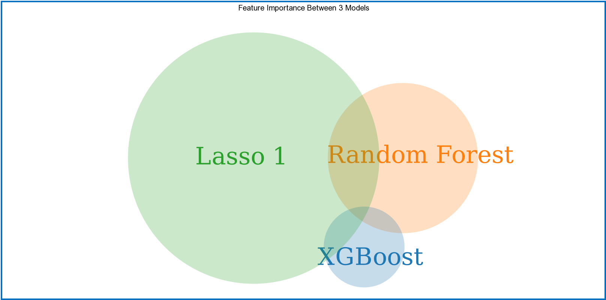

# Machine Learning to identify key genes in AML

## TLDR
1) Data cleaning: merge clinical, manifest, and ensemble gene info for three AML, WT and AML

2) Modeling: modeling on AML data to predict status of "Low Risk" vs. "Not Low Risk" (Standard + High) - if patient shows up more than once, use earlier one

- Lasso Logistic Regression on all 20,000+ features (gene ensembles) --> reduced to 3212
- XGBoost Classifier on all 20,000+ features (gene ensembles) --> 332 "important" features
- RF Classifier on all 20,000+ features (gene ensembles) --> reduced to 1147 "important" features

11 genes deemed important by all three models

Lasso run again until conversion, features reduced to **174 features**. 15 shared "important" features
between XGBoost and Lasso. Of those 15, 6 belong to original 11, 9 novel.

Those 20 genes warrant further investigation.

## File Structure Summary 
| Directory                  | Description                        | 
| ---------------------      |:----------------------------------:| 
|archives                    | old notebooks                      | 
|data                        | csvs after merge, in zip file      |
|pictures                    | pictures for readme                |
|model_walkthrough.ipynb     | notebook for modeling              |
|clean.py                    | cleaning and merging data          | 
|model_comp.py               | tools for modeling, sklearn        | 

dummies.py not used..

